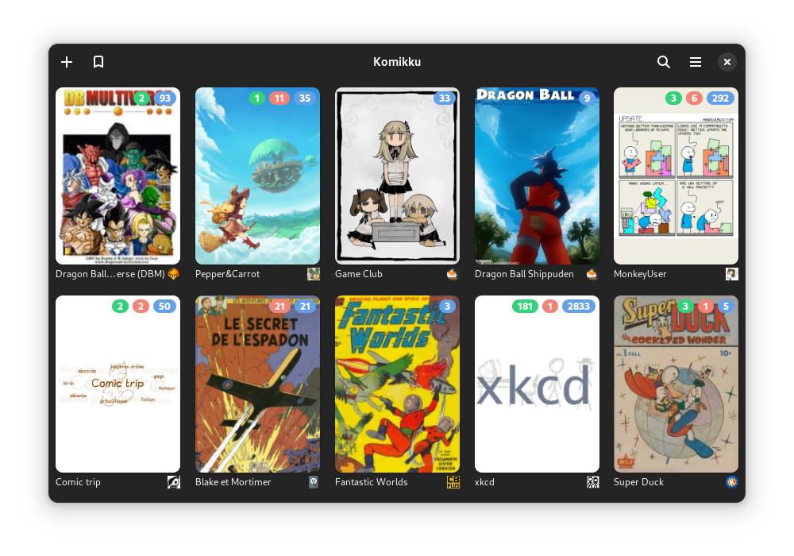

# <a href="https://apps.gnome.org/Komikku/">Komikku</a>

__Komikku__ is a manga reader for [GNOME](https://www.gnome.org). It focuses on providing a clean, intuitive and adaptive interface.

## License

__Komikku__ is licensed under the [GPLv3+](https://www.gnu.org/licenses/gpl-3.0.html).

## Keys features

* Online reading from dozens of servers
* Offline reading of downloaded comics
* Support for locally stored comics (in CBZ or CBR formats)
* RTL, LTR, Vertical and Webtoon reading modes
* Several types of navigation:
  * Keyboard arrow keys
  * Right and left navigation layout via mouse click or tapping (touchpad/touch screen)
  * Mouse wheel
  * 2-fingers swipe gesture (touchpad)
  * Swipe gesture (touch screen)
* Categories to organize your library
* Automatic update of comics
* Automatic download of new chapters
* Reading history
* Light and dark themes

## Screenshots

## Installation

### Flatpak

### Native package

__Komikku__ is available as native package in the repositories of the following distributions:

## Contributing

### Code

Please follow our [contributing guidelines](CONTRIBUTING.md).

### Translations

If you'd like to help translating __Komikku__ into your language, please head over to [Weblate](https://hosted.weblate.org/engage/komikku/).

### Code of Conduct
We follow the [GNOME Code of Conduct](CODE_OF_CONDUCT.md).
All communications in project spaces are expected to follow it.

## Sponsor this project

__Komikku__ is a `Free software`. If you like it and would like to support and fund it, you may donate through one of the plateform below. Any amount will be greatly appreciated __;-)__

|Plateforms|||
|:---:|:--:|---|
|Ko-fi||One-time or monthly donation|
|Liberapay||Weekly/monthly/yearly donation|
|PayPal||One-time donation|

## About the name

Komikku (コミック) is a Japanese word meaning `Comics`.

## Disclaimer

- The developers of this application does not have any affiliation with the content providers available.
- The application itself has no content and can be considered as a browser-like app.
